# 功能使用指南

大部分表单项已经在界面中提供了 tooltip、占位符或按钮说明。看到 `ⓘ` 图标、悬浮提示、输入框 placeholder 时，请优先查看界面内说明；本文重点补充整体流程、模块之间的关系，以及一些容易误解的特殊场景。

建议首次使用时按照 `设置中心` → `订阅管理` 或 `磁力下载` 的顺序完成配置。

---

## 1. 设置中心

设置中心包含 `下载设置`、`元数据设置`、`订阅设置`、`文件转移设置`、`通知设置`、`工具设置` 六个标签页。建议先完成基础配置再开始使用订阅或磁力功能。

### 1.1 下载设置

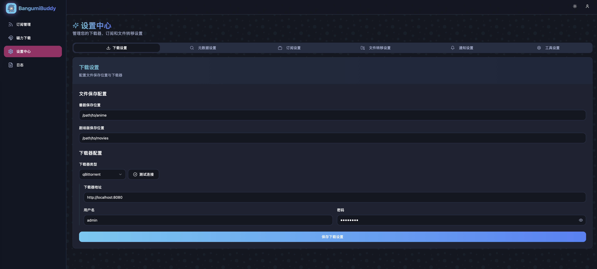

当前仅支持 `qBittorrent`。

这一页最需要明确的不是字段格式，而是"路径语义"：

- `番剧保存位置`：番剧种子的下载目录
- `剧场版保存位置`：电影/剧场版种子的下载目录

这两个目录不是最终媒体库目录，而是下载器先把文件落下来的地方。

建议保证以下两点：

- BangumiBuddy 进程能直接访问这些路径
- 后续文件转移时，这些路径和媒体库路径能建立正确的硬链接或软链接关系

下载器地址、用户名、密码等格式说明已经在界面里提供，保存前可以先点 `测试连接` 验证。

### 1.2 元数据设置

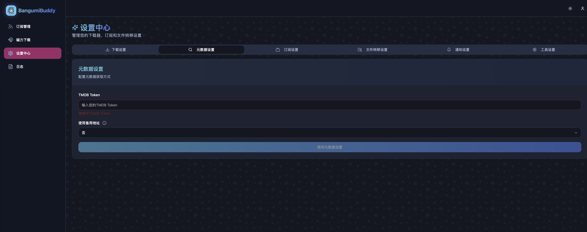

`TMDB Token` 是元数据识别的前置条件，不配置会直接影响：

- RSS 订阅识别
- 磁力任务识别
- 媒体库刮削
- 后续 NFO 或简介补全

`使用备用地址` 适用于当前网络环境无法稳定访问 TMDB 的情况。

### 1.3 订阅设置

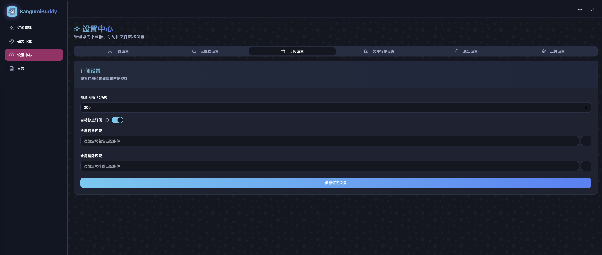

这一页控制的是全局 RSS 行为：

- `检查间隔（分钟）`：全局 RSS 轮询频率
- `自动停止订阅`：和每个订阅的 `总集数` 配合使用，当更新至总集数时自定停止订阅，不再轮训检测
- `全局包含匹配` / `全局排除匹配`：所有订阅都会共用的过滤条件

推荐使用方式：

- 全局规则：放统一偏好，例如统一只收 `1080p`
- 单订阅规则：放该作品独有的特殊条件

匹配语法和订阅详情页中的过滤规则一致，都是正则表达式。

### 1.4 文件转移设置

#### 1.4.1 基础配置

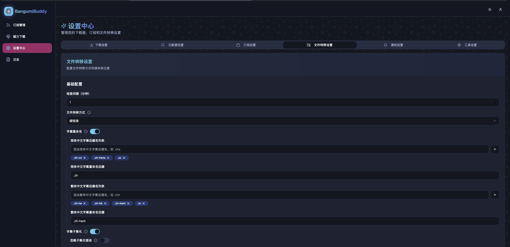

这里控制的是"下载完成后，多久整理一次文件"和"整理时采用什么方式"。

重点说明：

- `检查间隔` 是文件整理任务频率，不是 RSS 检查频率
- `硬链接` 推荐优先使用，不额外占空间，也不影响继续做种
- `硬链接` 需要下载目录和媒体库位于同一文件系统
- `软链接` 可以跨文件系统，但不同播放器或部署方式下兼容性会有差异

关于 `字幕重命名`：界面 tooltip 已给出说明，启用后会统一规范化字幕后缀，方便播放器自动识别语言。

关于 `字幕子集化` 和 `忽略子集化错误`：

字幕子集化是指在转移 ASS 字幕时，自动将字幕中引用的字体进行裁剪——只保留该字幕实际用到的字符对应的字形，然后把裁剪后的字体直接嵌入字幕文件。这样做的核心目的是：**让字幕在任何设备上都能按预期显示，不再依赖客户端本地是否安装了对应字体**。

不开启子集化时，如果播放器所在设备缺少字幕引用的字体，字幕就会回退到系统默认字体，导致样式丢失甚至显示异常。对于电视、手机、平板等不方便手动安装字体的设备，这个问题尤其明显。

开启子集化后：

- 字幕文件体积会增大（因为嵌入了字体数据）
- 播放器可以直接从字幕文件中读取嵌入字体，不需要额外安装
- 如果字体库中缺少字幕引用的某个字体，子集化会失败

`忽略子集化错误` 的作用是：当子集化处理失败时（通常是缺少字体），仍然继续转移原始字幕到媒体库，而不是卡住整个转移流程。

使用前提：必须先去 `工具设置` 初始化字体库，否则无法启用此功能

#### 1.4.2 媒体库配置

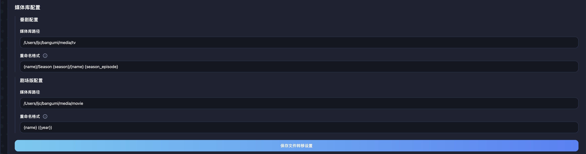

下半部分用于配置番剧媒体库和剧场版媒体库。

- `媒体库路径`：最终整理后的目标位置
- `重命名格式`：决定目录结构和文件名

变量说明已经在界面 tooltip 中完整列出，本文只强调两个常见结果：

- 电视剧通常整理为 `作品名/Season xx/文件名`
- 电影通常整理为 `作品名 (年份)`

### 1.5 通知设置

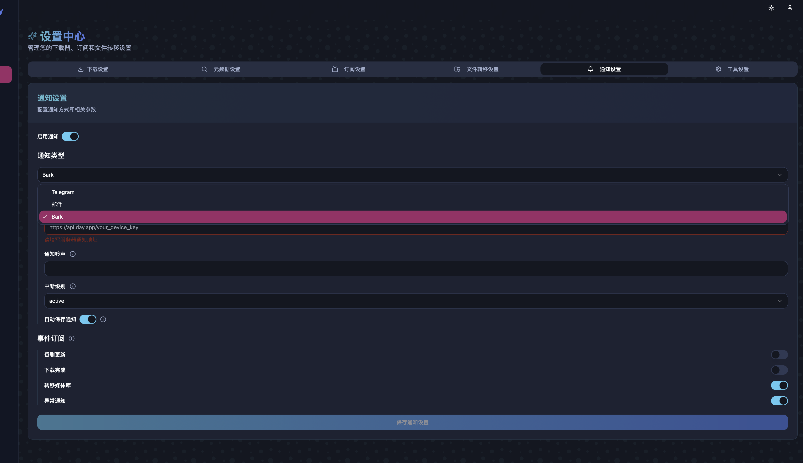

通知设置分为三层：

- `启用通知`：总开关
- `通知类型`：选择 Telegram、邮件或 Bark
- `事件订阅`：决定哪些事件会触发通知

当前可选的事件通常包括：

- 番剧更新
- 下载完成
- 转移媒体库
- 异常通知

各渠道字段的 tooltip 已经比较完整，文档只补充常见准备方式。

#### 1.5.1 Telegram

1. 在 Telegram 中搜索 [@BotFather](https://t.me/BotFather)
2. 发送 `/newbot` 创建机器人
3. 保存返回的 Bot Token
4. 给这个 Bot 发送一条任意消息
5. 获取 Chat ID 后填回界面

如果不知道自己的 Chat ID，可以使用常见的 Telegram 用户信息机器人，或者通过 Telegram Bot API 查询更新记录。

#### 1.5.2 邮件

配置时通常需要准备：

- SMTP 主机
- 发件邮箱账号
- 应用专用密码或授权码
- 收件邮箱

如果使用 QQ 邮箱等服务，通常需要填写授权码，不是网页登录密码。

#### 1.5.3 Bark

如果你使用 iPhone，可以在 Bark App 中获取推送地址，再填回界面。

- `Server Path`：Bark 推送地址
- `中断级别`、`自动保存` 等字段建议直接查看界面 tooltip

### 1.6 工具设置

#### 1.6.1 字幕子集化与字体库

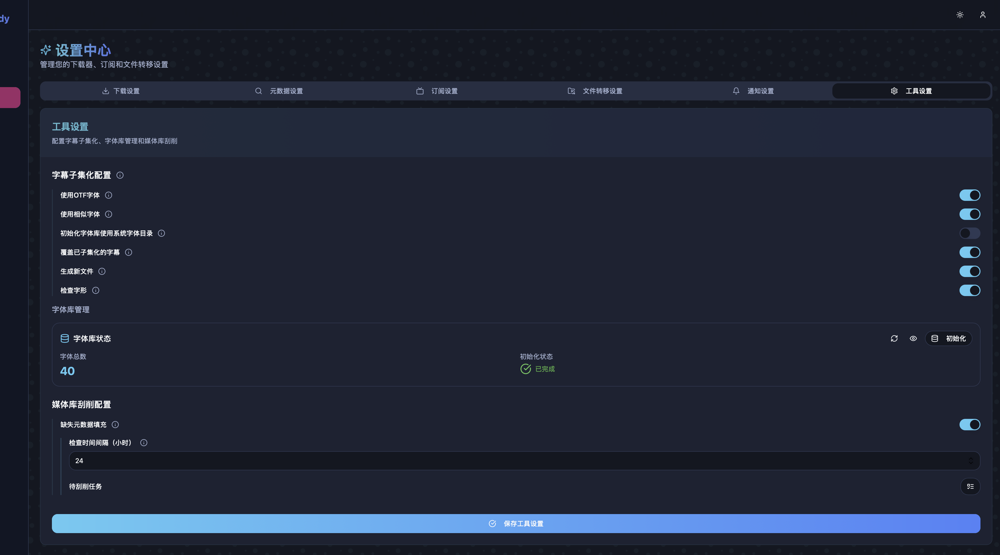

`工具设置` 的前半部分是字幕子集化的详细配置。子集化的原理和使用场景已经在上面 `1.4.1 文件转移设置` 中说明，这里补充各配置项的含义。

**字幕子集化配置项说明：**

- `使用 OTF 字体`：子集化生成的嵌入字体允许使用 OTF 字体；OTF 通常压缩率更好，但标准的ass字幕是不支持内嵌OTF字体的，开启这个选项可能会导致部分客户端无法正常显示字幕
- `使用相似字体`：当字体库中找不到字幕引用的精确字体时，尝试用家族名相近的字体替代（例如找不到粗体使用标准体代替），而不是直接报错
- `初始化字体库使用系统字体目录`：初始化字体库时，除了扫描 `/data/fonts` 目录外，还额外扫描系统字体目录
- `覆盖已子集化的字幕`：如果字幕本身已经被子集化过（例如上游压制组已经做过一次，或用本工具重复做子集化），是否覆盖重新生成
- `生成新文件`：开启后会生成独立的子集化字幕文件（如 `xxx.subset.zh.ass`），保留原始字幕不动；关闭则直接修改原字幕文件，覆盖原文件时，想要去除子集化可以删除[Fonts]一节
- `检查字形`：开启后会验证字体中是否确实包含字幕用到的所有字形，如果缺少则报错并停止该字幕的子集化

**字体库管理：**

字幕子集化依赖一个预先构建的字体库。使用步骤：

1. 将你收集到的字体文件放入 `/data/fonts` 目录（支持 TTF、OTF、TTC 等常见格式）
2. 点击 `初始化` 按钮扫描并建立字体索引
3. 扫描完成后，可以点击 `查看列表` 确认结果

额外提醒：

- 初始化字体库前，请先准备好字体来源目录
- 配置修改只会影响后续新的转移任务，不会自动回溯已完成的旧文件
- 如果你经常遇到子集化失败，大概率是缺少字体——优先补充字体文件后重新初始化

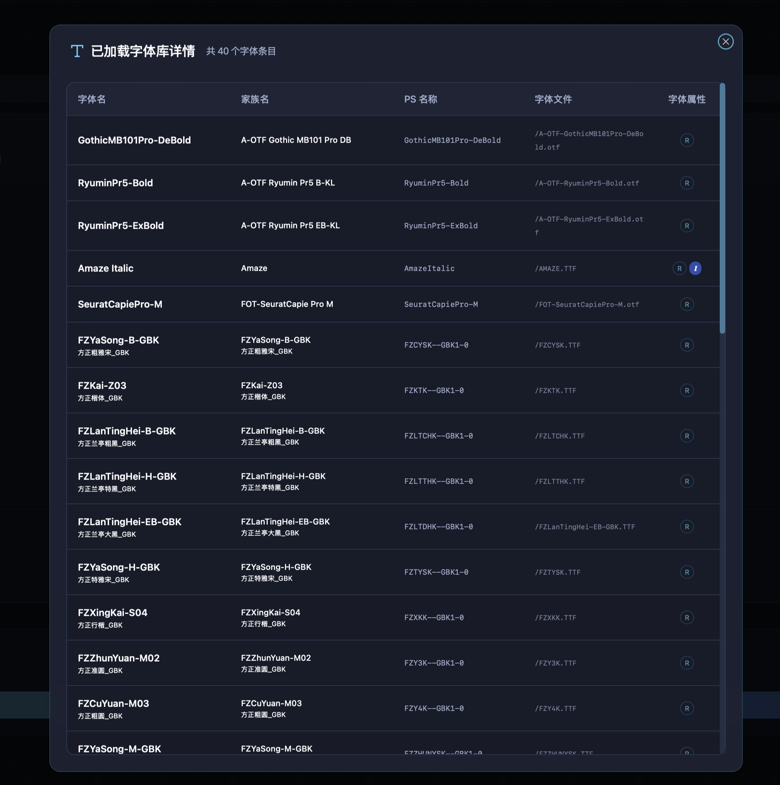

`查看字体库` 用于确认当前已经扫描到哪些字体文件。

这里可以看到：

- 字体名
- 家族名
- PS 名称
- 字体文件
- 字体属性

字体属性列会显示以下标志：

| 标志 | 含义 | 判断条件 |
| ---- | ---- | -------- |
| `L` | Light（细体） | 字重 < 400 |
| `R` | Regular（常规） | 字重 ≥ 400 且 < 700 |
| `B` | Bold（粗体） | 字重 ≥ 700 |
| `I` | Italic（斜体） | 字体本身带有斜体属性 |

一个字体可以同时显示字重标志和斜体标志，例如 `R` `I` 代表常规字重的斜体。子集化匹配字体时会参考这些属性，如果 ASS 字幕中指定了粗体或斜体样式，系统会尝试匹配具有对应属性的字体变体。

如果常用字幕字体没有出现在这里，优先检查字体是否真的放到了扫描目录，以及是否已经重新执行过初始化。

#### 1.6.2 媒体库刮削

**为什么需要刮削：**

当文件转移到媒体库后，Emby、Jellyfin、Plex 等媒体服务器会自动扫描并生成 NFO 元数据文件（包含标题、剧情简介、海报、单集图片等）。但在新番刚开播时，TMDB 上的数据往往不完整——可能缺少中文标题、剧情简介还没有翻译、单集海报尚未上传。这种情况下媒体服务器刮削到的结果就会有缺失或错误。

BangumiBuddy 的刮削功能会定时检查媒体库中已有的 NFO 文件，将其中的标题、简介、图片与 TMDB 最新数据进行对比。如果发现不一致或缺失，就会自动更新。这样你不需要手动去媒体服务器里逐个刷新元数据，系统会持续补全直到所有信息都齐全为止。

**适用范围和行为：**

- 当前只对订阅番剧生效，磁力任务不在自动检查范围内，（一般来说磁力任务推荐下载一些已经完结的番剧或剧场版，这类资源TMDB正常都有完整的元数据信息，对于老番，没有的话重复巡检补充意义不大）
- 只对开启此功能后新增的番剧生效，不会回溯处理之前已入库的内容
- 当某部番剧的标题、简介、图片全部与 TMDB 一致后，该番剧会自动退出检查队列，不再消耗额外请求

**配置项：**

- `缺失元数据填充`：总开关
- `检查时间间隔（小时）`：多久执行一次对比和更新，建议设置 24 小时即可，不需要过于频繁

**待刮削任务列表：**

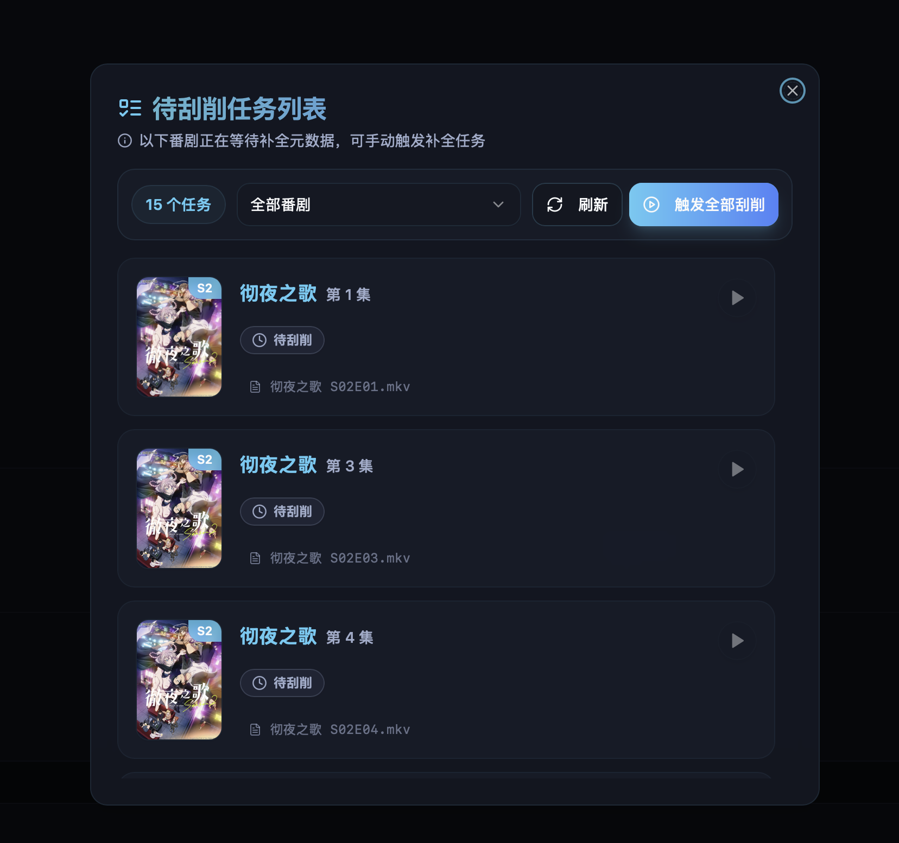

`待刮削任务列表` 用于查看哪些媒体文件还缺少元数据，你可以：

- 按番剧筛选
- 手动刷新
- 单独触发某一项刮削
- 一键触发全部刮削

这个页面适合排查以下问题：

- 文件已经转移成功，但简介、海报、单集图片还不完整
- 某部番剧长期没有补齐元数据
- 想立刻手动推动一次刮削，而不是等定时任务

---

## 2. 订阅管理

### 2.1 首页概览

BangumiBuddy 的首页就是「订阅管理」页面。

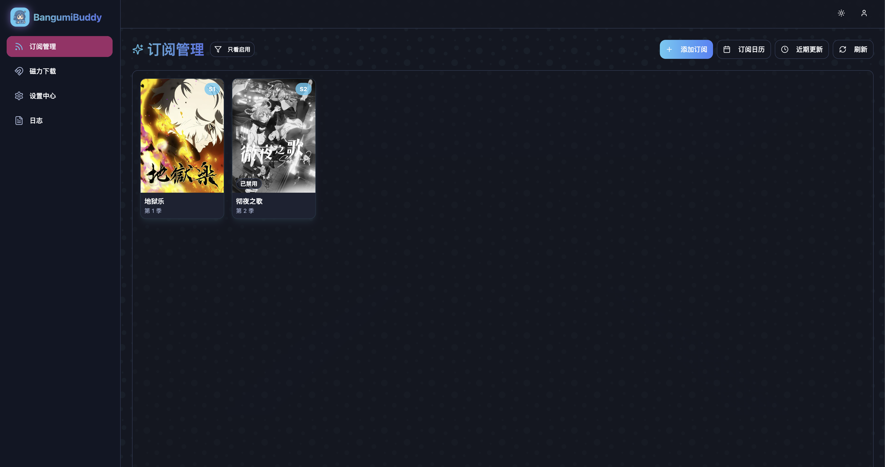

- `只看启用`：仅筛选仍会继续检查更新的订阅
- `添加订阅`：新增 RSS 订阅
- `订阅日历`：按星期查看当前追更安排
- `近期更新`：查看最近抓取到的 RSS 更新结果
- `刷新`：刷新订阅列表和状态
- 订阅卡片会展示海报、季数和当前状态；已经停用或不再更新的订阅会以更弱的视觉状态显示，方便与正在追更的订阅区分
- 点击订阅卡片可进入详情页，详情页左侧包含 `配置信息`、`订阅预览`、`文件管理` 三个标签页

### 2.2 添加订阅

#### 2.2.1 从 Mikan 复制 RSS 链接

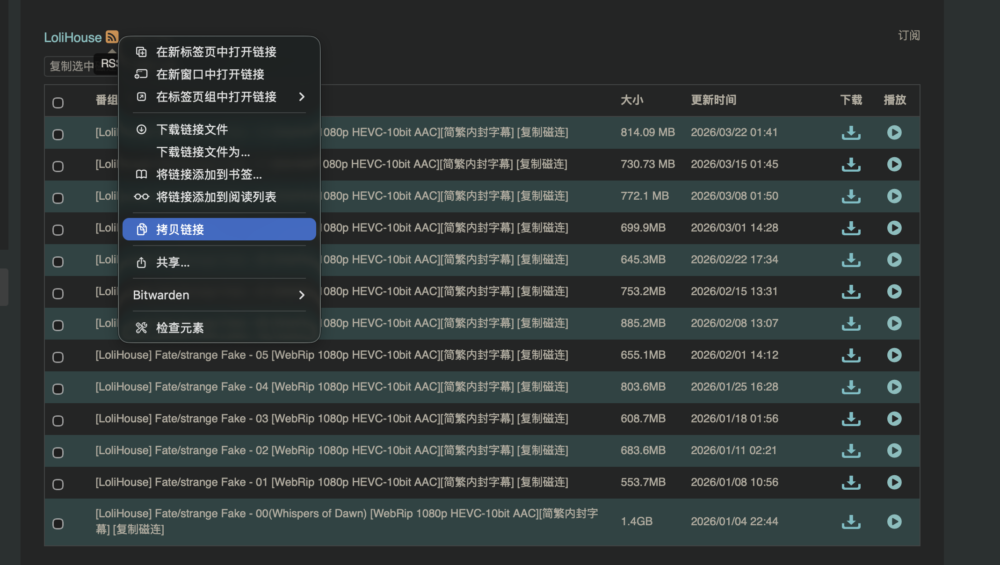

1. 在 Mikan 对应番剧或字幕组页面找到 RSS 图标
2. 右键选择 `拷贝链接`
3. 复制完整 RSS 地址，不要复制浏览器当前页面地址

建议尽量选你真正想追的字幕组或压制组对应的 RSS，后续会更容易控制更新来源。

#### 2.2.2 在 BangumiBuddy 中添加 RSS

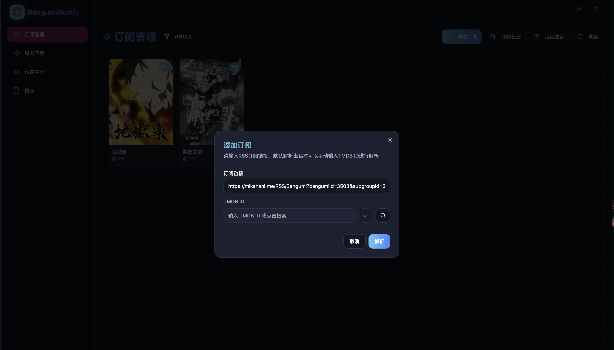

1. 打开 `订阅管理`
2. 点击右上角 `添加订阅`
3. 粘贴 RSS 链接
4. 点击 `解析`

一般情况下不需要手动填写 TMDB ID。只有在 RSS 自动识别失败时（一般是识别到的番剧名在TMDB搜索不到结果），才需要手动搜索 TMDB。

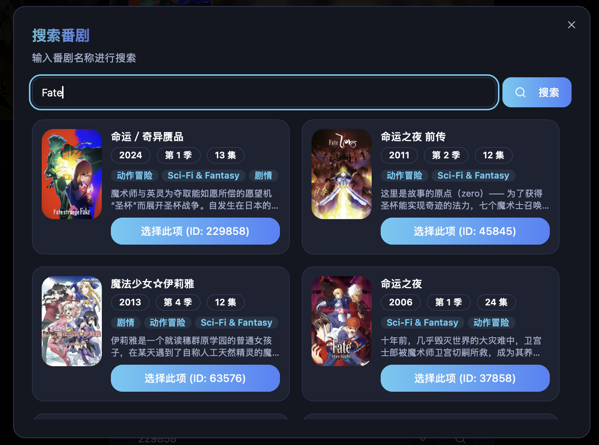

- 搜索时建议同时核对 `标题`、`年份`、`媒体类型`
- 如果是旧作新季、OVA、总集篇、剧场版，尤其建议人工确认一次
- 优先使用中文进行搜索

#### 2.2.3 确认订阅 — 基础信息

首次解析成功后，会进入订阅确认页，包含 `基础信息`、`过滤规则`、`高级设置` 三个标签。

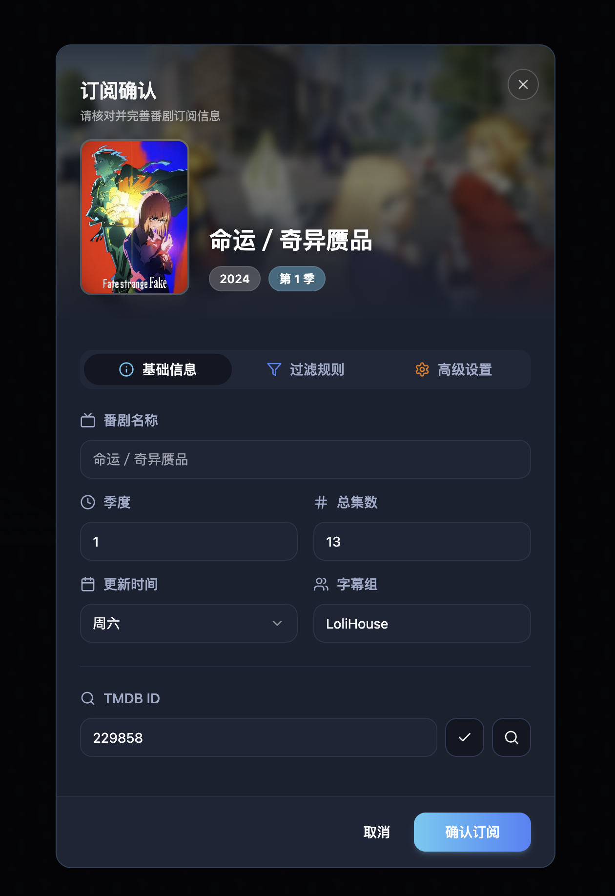

基础信息需要重点检查：

- `番剧名称`：自动从 TMDB 获取，不支持修改
- `季度`：默认取最新一季；如果你是在补旧番或 BD 合集，通常更适合使用 `磁力下载`
- `总集数`：会和全局 `自动停止订阅` 配合使用；如果总集数写错，可能导致过早停止轮训或永远不结束轮训。这个总集数TMDB初次获取到的数据可能是不准确的，需要手动修改
- `更新时间`：主要用于 `订阅日历` 展示
- `字幕组`：根据 RSS 自动识别，可自行修改
- `TMDB ID`：如果番剧识别不对，点击旁边的搜索按钮重新指定即可

#### 2.2.4 确认订阅 — 过滤规则

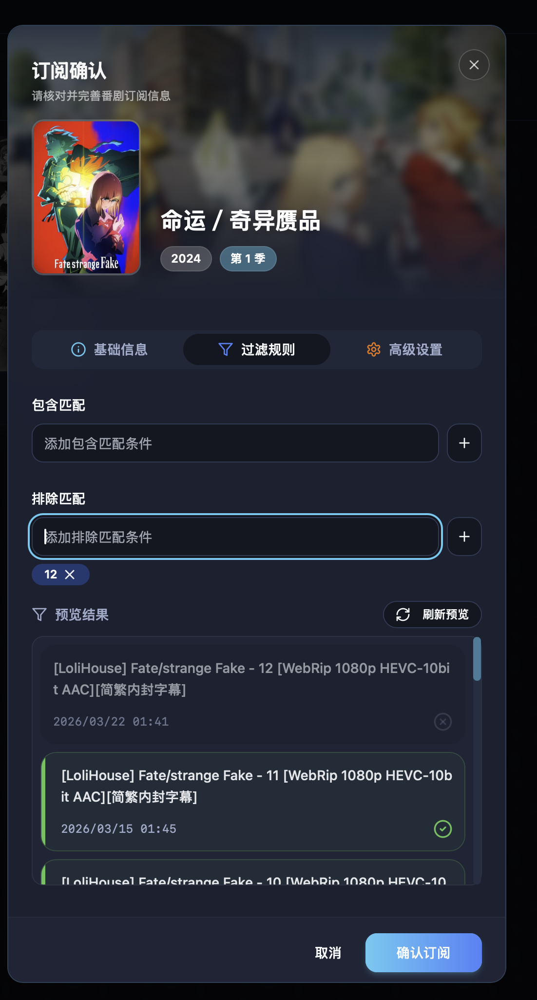

过滤规则使用正则表达式：

- `包含匹配`：只保留满足条件的资源，例如 `1080p`、`简体|简中|CHS`
- `排除匹配`：过滤不想要的资源，例如 `720p`、`繁体|繁中|CHT`

使用建议：

- 可以在预览结果中查看效果
- 全局过滤适合放统一偏好，例如统一只收 `1080p`
- 单订阅过滤适合补充某一部作品的个性化规则

#### 2.2.5 确认订阅 — 高级设置

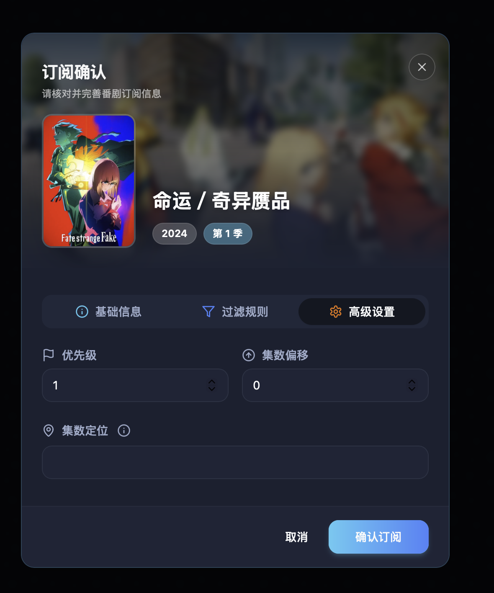

- `优先级`：同一作品存在多个订阅源时，数值越大优先级越高，高优先级在转移媒体库时会覆盖低优先级的资源
- `集数偏移`：适用于 RSS 标题里的集数和实际集数不一致的情况，例如标题显示第 1 集实际是第 13 集，则偏移设为 `12`，支持负数
- `集数定位`：高级识别配置，界面 tooltip 已提供详细格式说明和示例，只有自动识别不稳定时再调整即可

### 2.3 管理订阅

#### 2.3.1 订阅配置

订阅创建后，仍然可以在详情页的 `配置信息` 中继续调整配置。

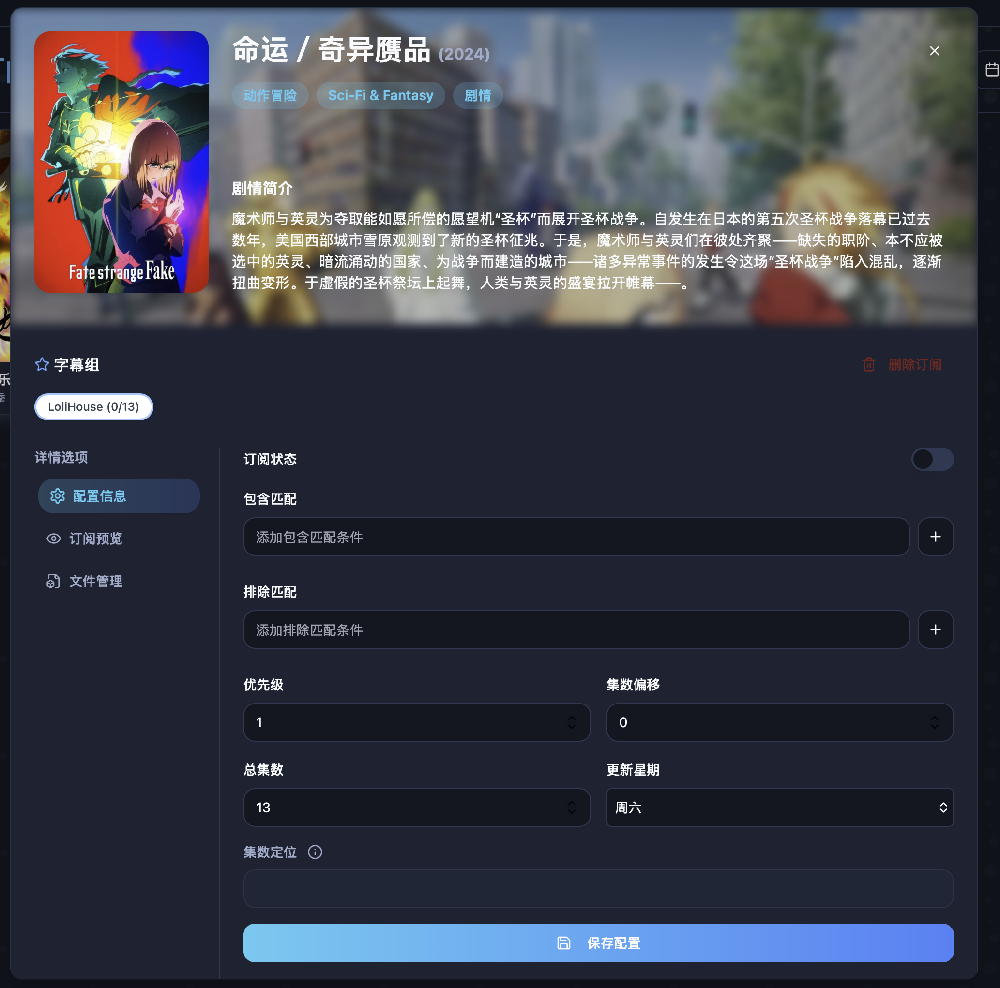

- `订阅状态`：控制该订阅是否继续参与后续定时检查
- 包含/排除匹配、优先级、集数偏移、总集数、更新星期、集数定位等字段与添加时一致
- 可以在这里删除订阅

这一页大部分字段都已经提供了 tooltip 或与确认订阅相似，不再详细说明

#### 2.3.2 订阅预览

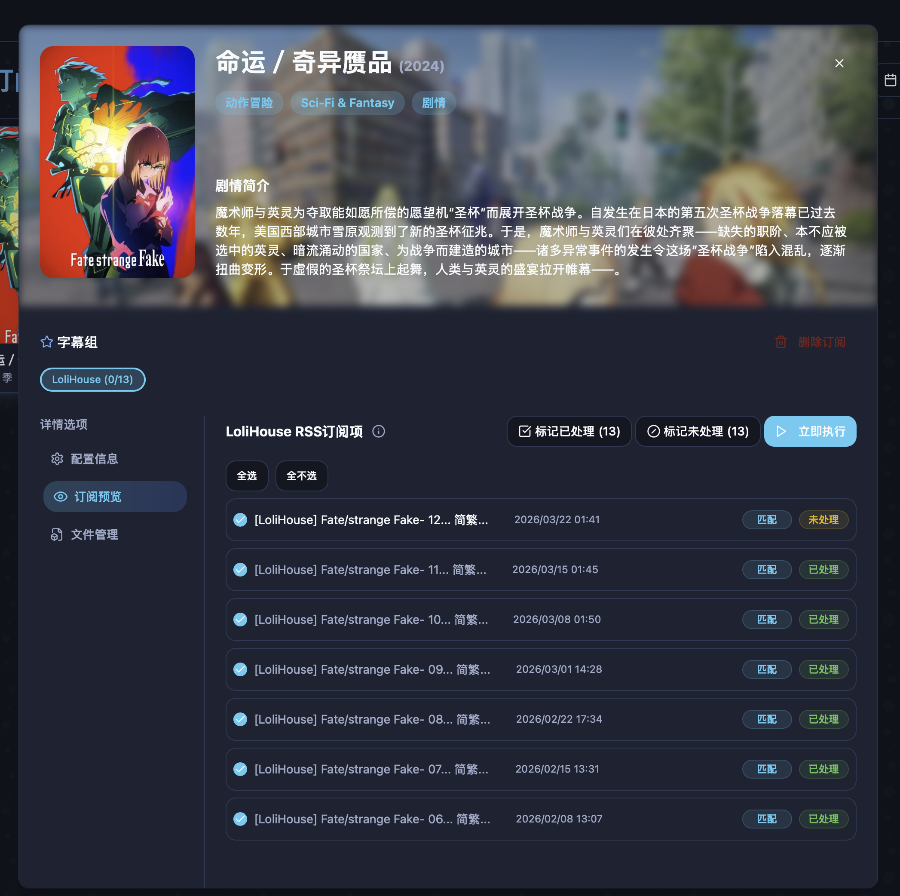

`订阅预览` 用于查看当前 RSS 中所有历史条目，以及每条记录在当前规则下的状态。

- `匹配`：说明该 RSS 项满足当前过滤规则
- `已处理`：说明该条目已经被系统处理过
- `未处理`：说明该条目还没有被系统处理
- `标记已处理`：适合手动跳过某些条目
- `标记未处理`：适合重新放开某些条目，让系统后续再次处理
- `立即执行`：按当前匹配状态立刻执行一次处理流程

这个页面主要用于**调试过滤规则**、**不修改过滤规则的情况下跳过某些集数**、**重复下载某些集数**

#### 2.3.3 文件管理

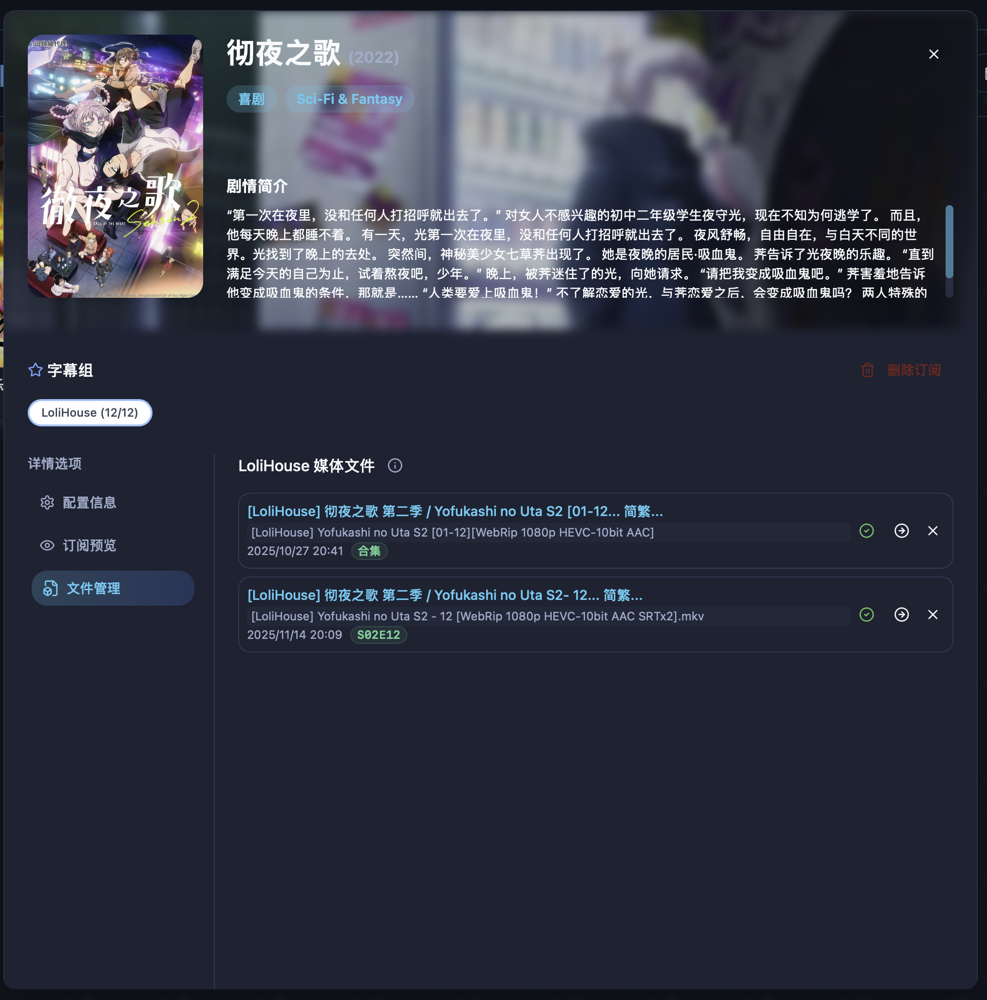

`文件管理` 展示该订阅已经生成的下载记录和处理结果。

你可以在这里看到：

- 下载到的种子名称
- 当前文件对应的季集信息，例如 `S02E12`，用于查看集数偏移效果
- 是否被识别为 `合集`
- 当前文件的处理进度（下载中、已下载但未转移、已转移以及某一步骤失败）
- 后续是否已经完成转移

右侧的第一个操作按钮可用于查看处理结果（完成时查看转移前后的文件路径，失败时查看失败原因）、再次触发文件转移或删除（删除可以选择删除媒体库文件、源文件或全部删除），具体按钮含义请以界面悬浮提示为准。

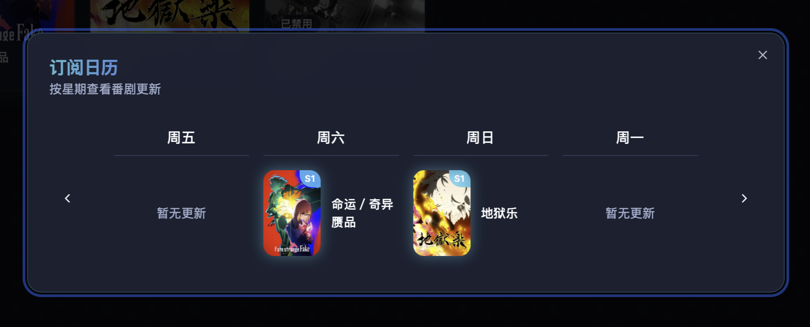

`订阅日历` 会按星期聚合所有正在追更的订阅。

- 每个卡片展示的是你在订阅中配置的更新星期和目标季信息

#### 2.3.5 近期更新

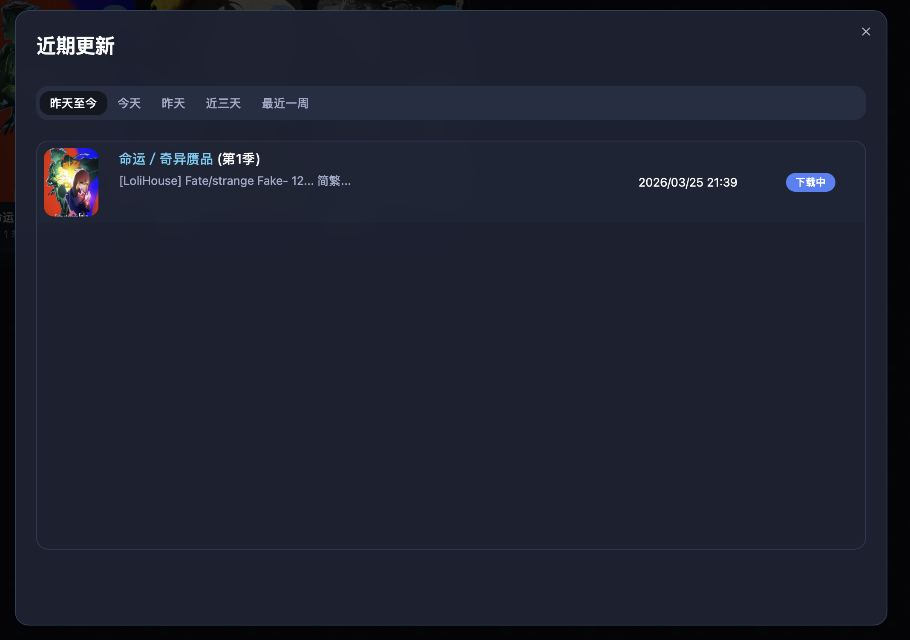

`近期更新` 会按时间范围查看最近抓取到的 RSS 更新结果。

- 支持 `昨天至今`、`今天`、`昨天`、`近三天`、`最近一周` 等时间范围切换
- 列表中会展示番剧、RSS 条目标题、更新时间和当前状态
- 右侧状态会显示当前处理阶段，例如 `下载中`

一般用来查看最近有哪些订阅更新了，处理结果怎么样

---

## 3. 磁力下载

除了自动 RSS 订阅，BangumiBuddy 还支持手动添加磁力任务。这个功能更适合用来处理旧番、剧场版、BD 合集等非 RSS 资源。

### 3.1 任务列表

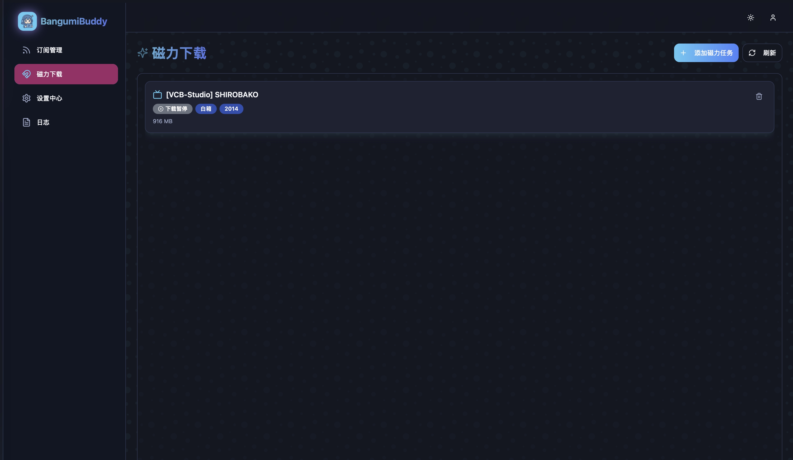

`磁力下载` 页面会以任务卡片方式展示当前磁力任务。

- 卡片会显示种子名、状态、媒体类型、年份和大小
- 点击卡片进入详情页
- 右上角可以继续 `添加磁力任务` 或手动 `刷新`

如果一个任务状态颜色或文案看不明白，优先查看界面 tooltip，因为状态提示是跟当前处理阶段实时联动的。

### 3.2 添加磁力任务

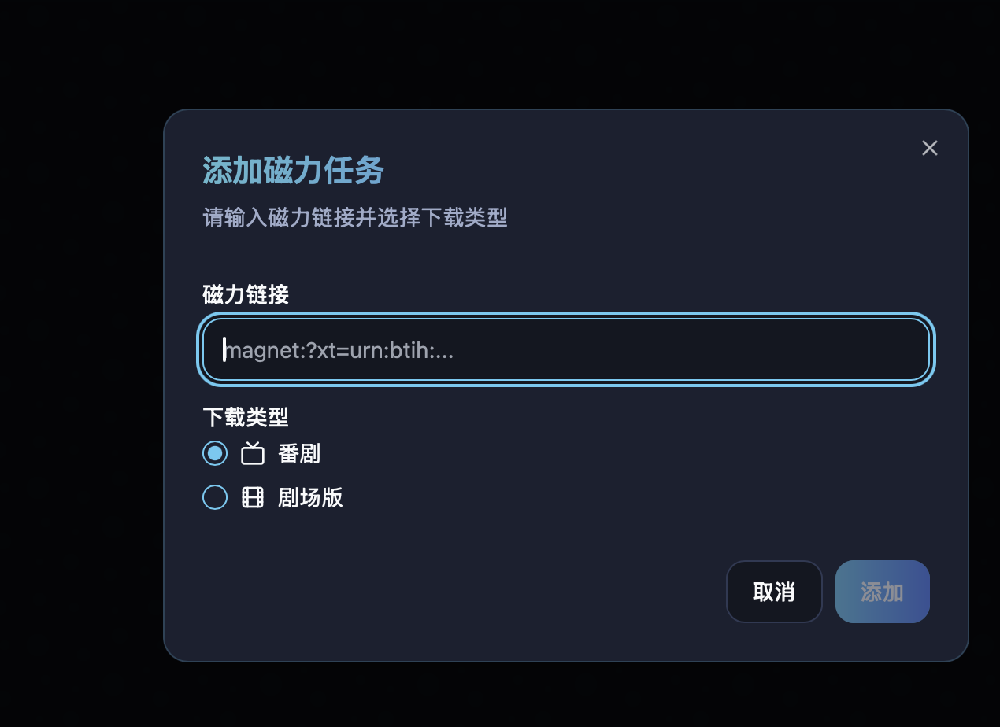

1. 点击 `添加磁力任务`
2. 粘贴 `magnet:` 链接
3. 选择下载类型
4. 点击 `添加`

下载类型的区别需要特别注意：

- `番剧`：用于季番、OVA、SP、合集等按"分集"处理的资源
- `剧场版`：用于电影、总集篇、单文件电影资源

这里的选择会直接影响后续的 TMDB 搜索范围、文件识别方式和最终媒体库路径

### 3.3 识别确认与任务状态

添加任务后，通常需要先确认系统识别到的信息。

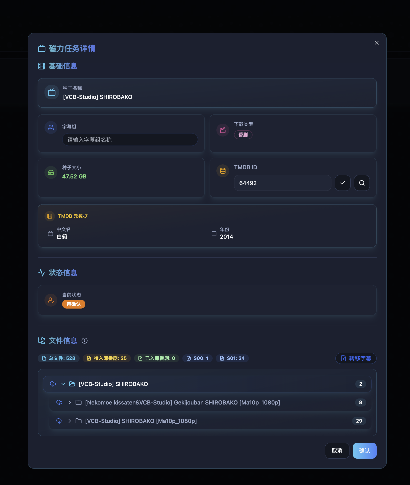

这一步需要重点检查：

- `字幕组` 是否正确
- `下载类型` 是否正确
- `TMDB ID` 和 TMDB 元数据是否正确
- `文件信息` 里的统计是否符合预期

文件信息区域会统计：

- 总文件数
- 待入库番剧数
- 已入库番剧数
- 当前识别到的季分布，例如 `S00`、`S01`

如果 TMDB、季集、文件筛选任何一个环节不对，后续转移结果通常也会出错，所以建议在这一页先改对再点击 `确认`。

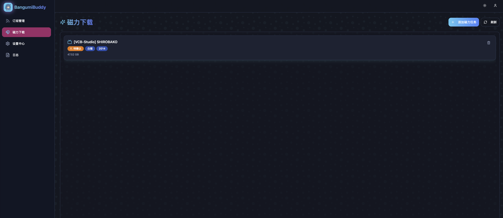

添加完磁力任务后，列表里会直接显示 `待确认`。这代表任务已经进入下载器，但还没有完成最终的入库规则确认。

只要任务仍处于 `待确认` 或 `待解析`，都建议进入详情页检查一遍。

### 3.4 自动解析失败与手动解析

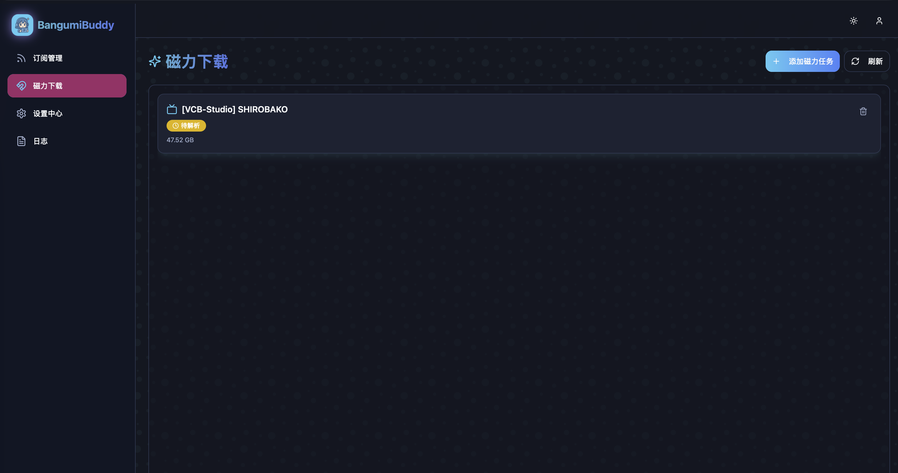

这种情况比较常见，主要是以下的场景：

- 磁力链接的名称无法在TMDB搜索到相关的数据
- 种子比较老，下载器长时间无法下载完成种子元数据，就无法解析种子名称

添加任务解析失败时，任务会停留在 `待解析`。

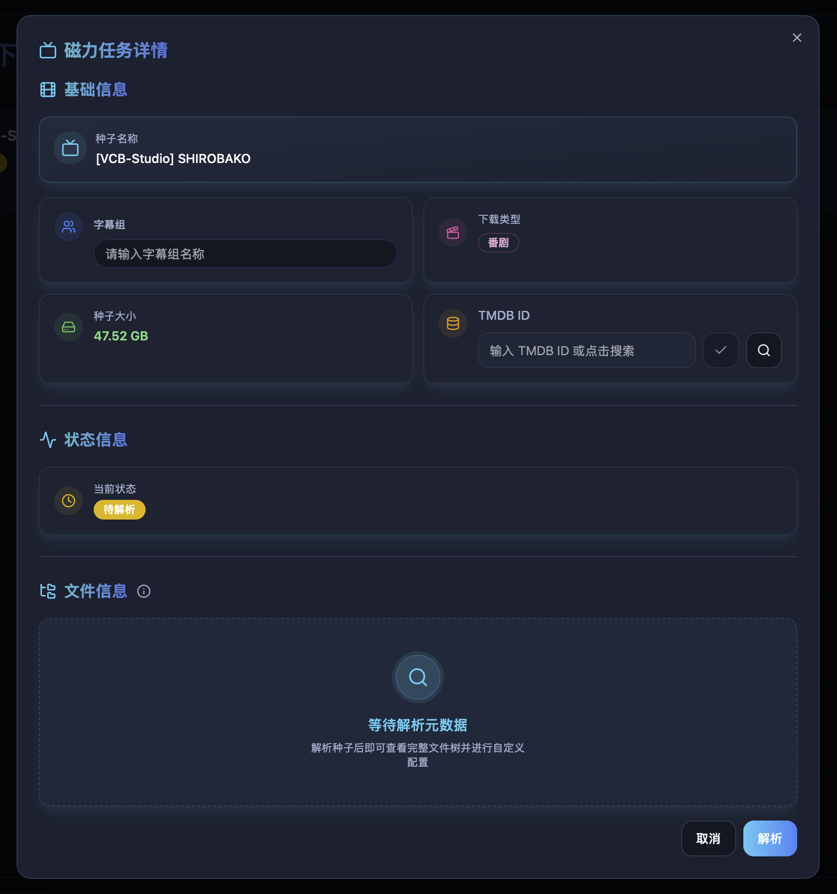

手动处理方式：

1. 打开任务详情
2. 补充 `TMDB ID` 或直接手动搜索 TMDB
3. 确认下载类型是否正确
4. 点击 `解析`

解析成功后，下方原本空白的 `文件信息` 区域会生成完整文件树，之后才可以继续做文件筛选、季集修正和字幕转移。

### 3.5 选择入库文件与标记媒体文件

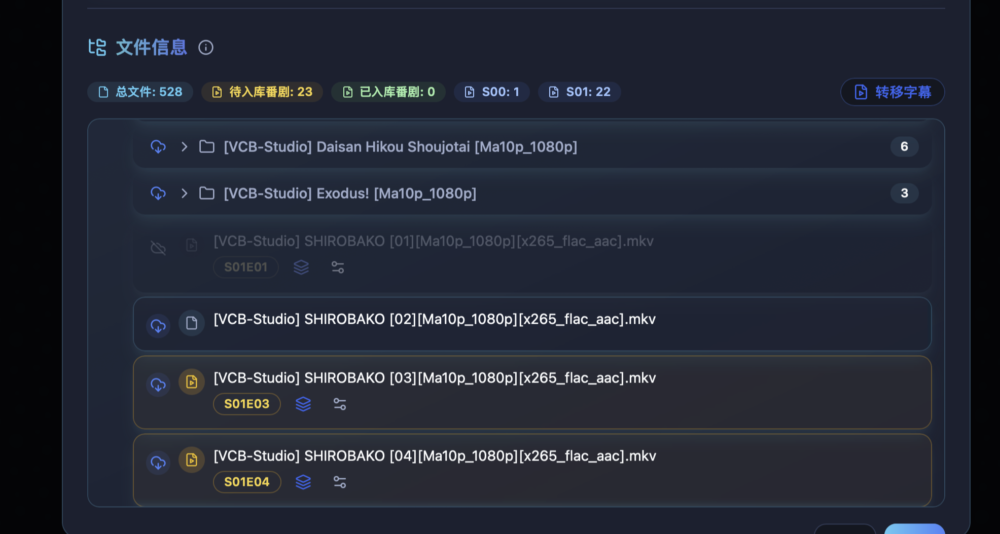

文件树会按目录结构展示当前种子的全部文件。这一步主要是用来查看自动识别的信息是否准确，如果不准确需要人工修正。通常BD资源等组织形式不固定，系统无法兼容所有的情况

这里最重要的概念是：**只有被识别或被你手动标记为媒体文件的条目，才会参与后续入库和文件转移**

常见不需要入库的内容包括：

- 字体包
- 菜单文件
- 图片
- 说明文档
- 音频外挂资源
- 其他明显不是正片的视频或附件（**当前不支持SP、PreView等资源的转移**）

这一块的按钮和图标较多，界面中的 tooltip 已经覆盖了大部分说明。文档只补充两个判断原则：

- 顶部统计数字能快速告诉你"当前到底有多少文件会被当成媒体处理"
- 如果看到大量无关文件被统计进 `待入库番剧`，应该立刻在这里先修正，不要直接确认

### 3.6 手动修正单个文件的季集信息

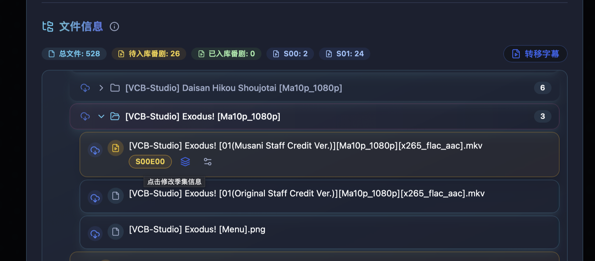

当单个文件的 `SxxExx` 识别错误时，直接点击该标签即可修改。

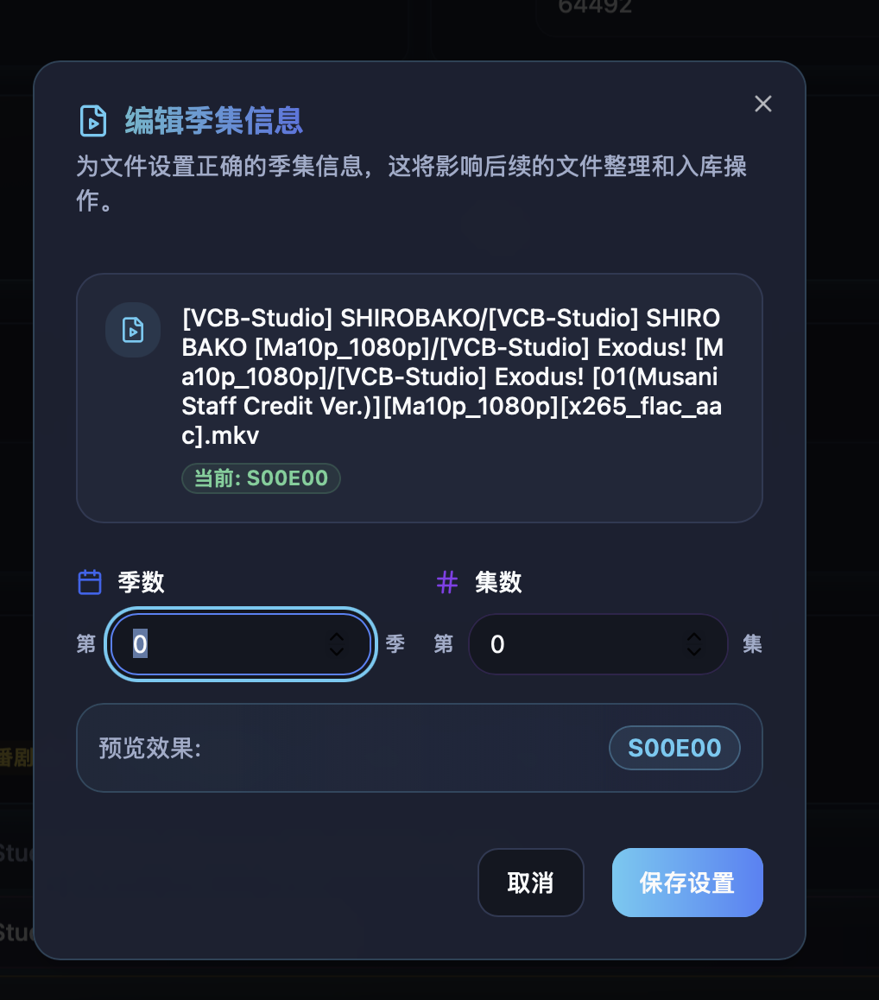

编辑弹窗会显示：

- 当前识别出来的季集
- 手动调整后的季数和集数
- 最终预览结果

这些修改会直接影响后续的文件命名、整理路径和媒体库识别结果，所以不要把这一步当成纯展示信息。

### 3.7 批量修正相似文件

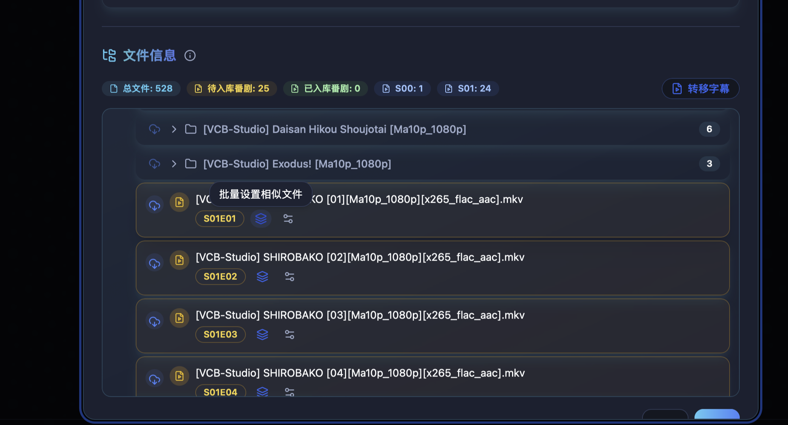

对于连续编号、命名模式一致的一组文件，可以使用批量设置入口。

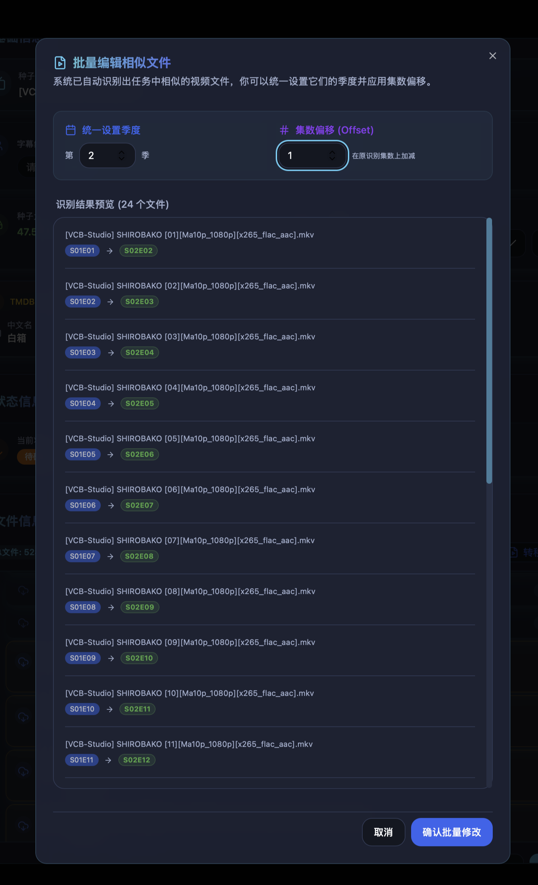

批量编辑适合以下场景：

- 整个目录都识别到了错误季数
- 集数整体需要加减偏移
- BD 合集、特典合集这类批量资源需要统一调整

界面会预览每个文件修改前后的 `SxxExx` 对照，确认无误后再保存即可。

### 3.8 自定义文件元数据

如果一个 `番剧` 任务中混入了剧场版、总集篇、特别篇等不同类型内容，单纯依赖任务级别的默认类型通常不够，这时应该使用文件级自定义元数据。

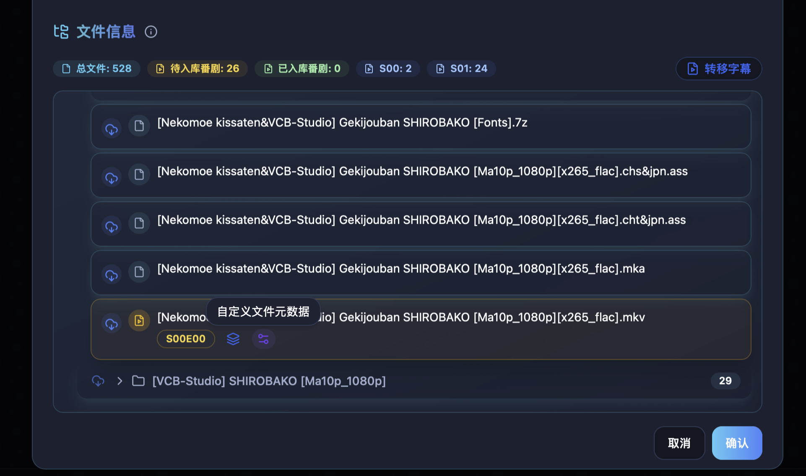

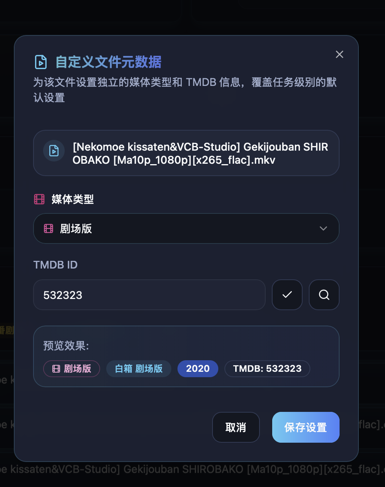

文件级自定义元数据可以单独为某个文件指定：

- 媒体类型
- TMDB ID

补充说明：

- 文件级设置会覆盖任务级默认设置
- 下方 `预览效果` 展示的是这个文件最终会使用的元数据结果
- 这个功能很适合处理"番剧种子里混了剧场版正片"这类复杂情况

### 3.9 转移字幕

`转移字幕` 用于把外挂字幕整理到当前任务对应的媒体文件上，在转移时一起转移
适合资源本身不包含字幕，字幕文件是从其他地方下载过来的，这类字幕文件一般和媒体文件命名不一致，此时可以用转移字幕功能方便的整理字幕

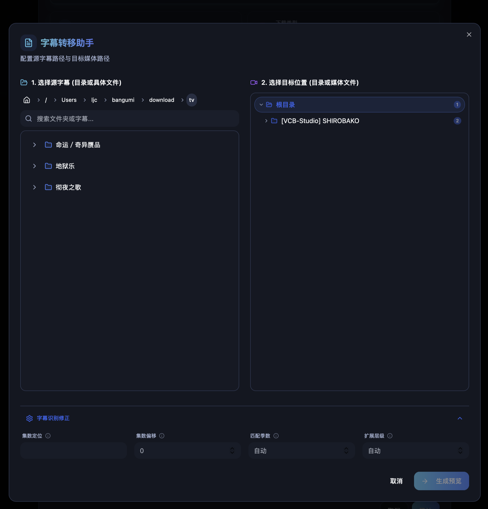

推荐流程：

1. 左侧选择字幕源目录或具体字幕文件
2. 右侧选择目标视频目录或具体媒体文件
3. 根据需要调整 `集数定位`、`集数偏移`、`匹配季数`、`扩展层级`
4. 点击 `生成预览`

这些修正字段都已经有 tooltip，文档不再重复逐项说明。第一次使用时，建议先认真看一下界面里的解释。

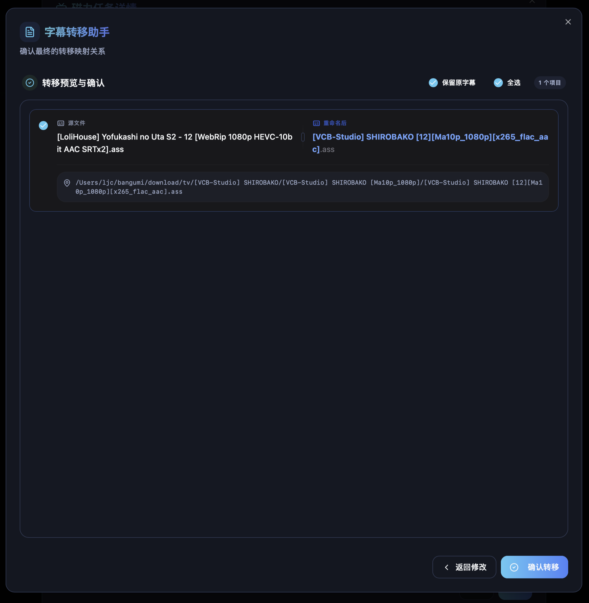

预览页会列出 `源字幕文件 → 重命名后的目标文件` 的映射关系。

建议在这里重点检查：

- 是否映射到了正确的视频
- 重命名后的字幕文件名是否符合预期
- 是否有多余或遗漏的映射项

确认后字幕会先进入当前下载任务对应位置，后续再通过正常的文件转移流程一起进入媒体库。

---

## 4. 日志查看

日志页面用于查看程序运行日志。

可以在这里进行：

- 实时查看日志输出
- 按日志级别筛选
- 关键字搜索

日志文件默认位置：

`/data/log/log.log`
